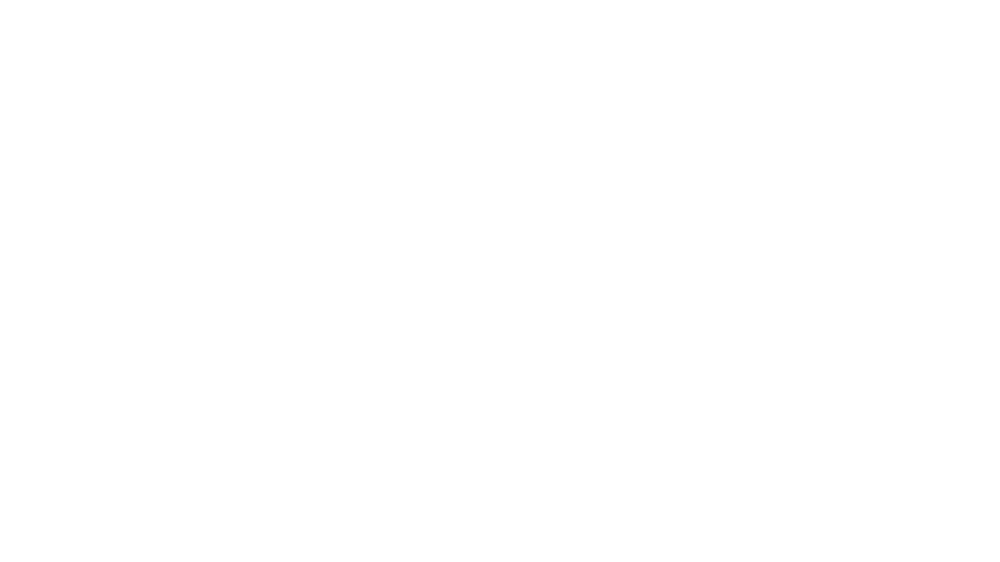

# **שלום רב! ברוך הבא לדוקומנטציה העברית!**
אנחנו כל כך שמחים שאת/ה פה, ואנחנו לא יכולים להתחיל ללמוד ביחד אתך את עולם התכנות ברובלוקס! אבל, מגיע לך הסבר:
# הסבר
הודקומנטציה העברית הינו פרויקט קהילתי שמהותו לתת מענה למתכנתים צעירים/חדשים שרוצים ללמוד בשפת הקודש 🕍 בעזרת כולם, נוכל להפוך את החלום של דוקומנטציות בעברית למציאות! 🔮
ובעצם, אתם נמצאים באתר בו ים אנשים בואו ביחד ועזרו לנו לכתוב מדריך Zero To Hero (ממתחיל למתקדם) לתכנות ברובלוקס **בשפה העברית**, מרגש לא?
